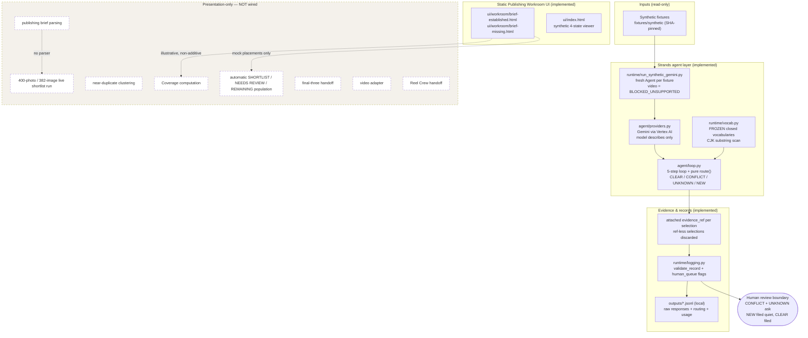

# Second Eyes — Architecture (as implemented)

> Read this diagram with the legend. Dashed nodes are **presentation-only**:
> they appear in the static Publishing Workroom mock and in copy, but no
> runtime connection exists. Solid nodes are implemented and tested.

## What's real vs what's mock

| Layer | Status | Evidence |
|---|---|---|
| Strands agent loop + pure `route()` | Implemented, 15/15 tests | `agent/loop.py`, `tests/test_route.py` |
| Gemini provider (Vertex, image only) | Implemented, live smoke OK | `agent/providers.py`, `runtime/check_gemini.py` |
| Fresh-agent-per-fixture isolation | Implemented | `runtime/run_synthetic_gemini.py` |
| Evidence refs + validated run records | Implemented | `runtime/logging.py`, local `outputs/` |
| Frozen vocabularies | Implemented + frozen pre-run | `runtime/vocab.py` freeze note |
| Synthetic fixtures (6, SHA-pinned) | Implemented | `fixtures/synthetic/` |
| Publishing Workroom static pages | Implemented (mock placements) | `ui/workroom/`, `ui/index.html` |
| Brief parsing / live 400-run / clustering / coverage / auto-population / final-three / video adapter / Reel Crew handoff | Presentation-only | `docs/shortlist-brief.md` (spec, no runner) |

## Key contracts

- The model describes; **only `route()` decides** (structural, not prompt-based).
- Selections without an attached `evidence_ref` are discarded, never routed.
- Closed vocabularies are frozen; post-run additions are forbidden.
- Synthetic fixtures prove plumbing only — never accuracy.
- No brief = no clearance basis; every photo is 待確認 at best.
